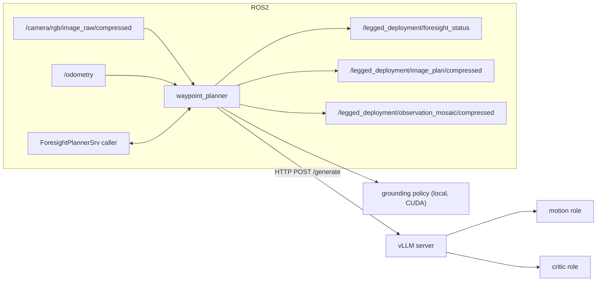

# Architecture


The motion planner and motion critic are two roles of the same VLM. The planner
proposes an image-space trajectory, the critic judges it and emits a verdict plus a
reason, and on a negative verdict the planner refines its proposal. Once a plan is
accepted, a separate grounding policy lifts it from image space into metric BEV
waypoints.

## Deployment topology

At deployment that pipeline is split across two processes so the model server and
the ROS2 planner can be restarted independently.



The planner buffers a pose-spaced window of the last four observations (one every
`1.06 m`), sends them to the vLLM server as a motion query, parses the returned
normalized pixel trajectory, and lifts it to metric `(x, y, z)` waypoints with the
local grounding policy. When critic prompts are configured it then asks the critic
role to judge the proposal and, on a negative verdict, runs one refinement round.

Because the released motion and critic weights are co-trained into a single
checkpoint, the server detects the shared model path and serves both roles from one
vLLM engine.

The planner node's full topic and service list is documented in
[legged_deployment/README.md](../legged_deployment/README.md).

## Service interface

The planner's service interface is not vendored in this repository. You need a ROS2
interface package providing `ForesightPlannerSrv` and `ForesightPlannerMsg`. Build
[amrl_msgs](https://github.com/ut-amrl/amrl_msgs) into the same workspace, or create
an equivalent `ament_cmake` interface package containing:

`srv/ForesightPlannerSrv.srv`
```
std_msgs/String goal_command
---
amrl_msgs/ForesightPlannerMsg foresight_plan
```

`msg/ForesightPlannerMsg.msg`
```
std_msgs/Header header
nav_msgs/Path path
uint32 reflection_id
std_msgs/Bool verdict
std_msgs/String reason
std_msgs/String thinking_text
std_msgs/String motion_text
std_msgs/String critic_text
sensor_msgs/CompressedImage motion_image
```

The service response carries the final `nav_msgs/Path` in the `odom` frame along
with the critic's verdict and reason. Each refinement round is additionally
broadcast on `/legged_deployment/foresight_status` as it happens, so a visualizer
can show intermediate proposals rather than only the final plan.

## Model variants

Three variants are supported by pairing a server config with a planner config. Both
launch arguments take paths under `legged_deployment/config/`.

| Variant | `vllm_config` | `planner_config` |
| --- | --- | --- |
| No refinement | `vllm_server_sft.yaml` | `waypoint_planner_norefine.yaml` |
| SFT (default) | `vllm_server_sft.yaml` | `waypoint_planner.yaml` |
| RL | `vllm_server_rl.yaml` | `waypoint_planner.yaml` |

```bash
# RL weights with self-critique refinement
ros2 launch legged_deployment vllm_server.launch.py \
  vllm_config:=src/foresight_public/legged_deployment/config/vllm_server_rl.yaml

# single motion pass, no critic
ros2 launch legged_deployment deployment.launch.py \
  planner_config:=src/foresight_public/legged_deployment/config/waypoint_planner_norefine.yaml
```

The no-refinement variant runs the same weights as the SFT variant but sets
`max_reflections: 0` and leaves the `critic`, `motion_refine`, and `critic_refine`
prompt slots empty, so the planner returns its first motion proposal directly.

## Configuration

`legged_deployment/config/waypoint_planner.yaml` holds the ROS2 parameters. The ones
most likely to need changing:

| Parameter | Default | Purpose |
| --- | --- | --- |
| `image_topic` | `/camera/rgb/image_raw/compressed` | RGB input |
| `pose_topic` | `/odometry` | Pose used to space the observation window |
| `path_frame_id` | `odom` | Frame the returned path is expressed in |
| `obs_frame_id` | `base_link` | Frame the model's waypoints start in |
| `image_resolution` | `[224, 392]` | Height, width fed to the model |
| `obs_window_size` | `4` | Observations per query |
| `obs_window_spacing_m` | `1.06` | Distance between buffered observations |
| `max_reflections` | `1` | Self-critique rounds beyond the first proposal |
| `llm_cfg.host` / `llm_cfg.port` | `127.0.0.1` / `8001` | vLLM server address |
| `grounding_policy.checkpoint_path` | `checkpoints/waypoint_policy/...` | Grounding policy weights |

`image_resolution` and the grounding policy's `action_head` overrides must match the
released checkpoints; changing them requires retraining.

Server-side settings live in `legged_deployment/config/vllm_server_*.yaml`, which is
flattened into Hydra overrides for `scripts/interactive/launch_vllm_server.py` by
`legged_deployment.vllm_config_loader`. The base per-role model profiles are composed
from `configs/model/vlm/`.

## Repository layout

```
configs/model/vlm/        per-role VLM profiles (motion, critic, reward)
configs/model/waypoint/   grounding policy architecture
foresight/                model code, prompts, geometry and drawing helpers
legged_deployment/        ROS2 ament_python package (planner node + launch files)
scripts/interactive/      vLLM server entrypoint and its Hydra root config
```
